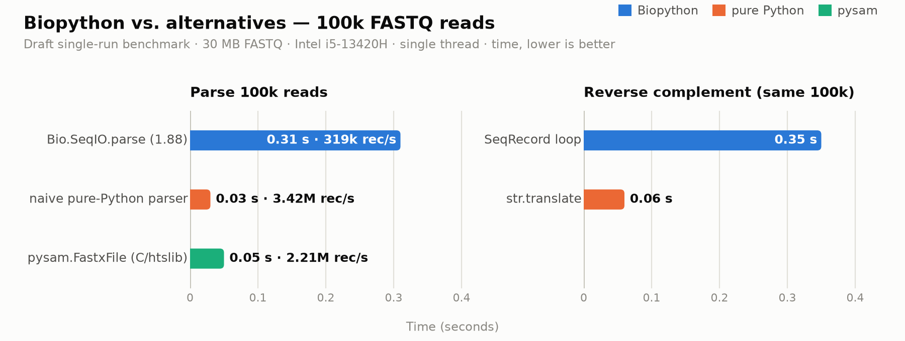

# BioFasting

<p align="center">
  
</p>

<p align="center">
  
  
  
  
  
</p>

A C/C++-backed core library for sequence bioinformatics, built to close the
7–10× performance gap Biopython leaves open on hot paths — aiming to become the
*numpy of bioinformatics*: a fast substrate that other tools build on, not
another API clone on top of it.

**Status:** pre-alpha. Phase 0 (evidence) and Phase 1 (the FASTQ/FASTA flagship
core) are **complete**: the C++ core builds, imports and reports its own build
identity, and both flagship readers are here — `biofasting.open_fastq()` for
plain and gzipped
FASTQ, `biofasting.open_fasta()` for an indexed FASTA — along with the first
sequence operations that dispatch on the CPU at runtime
(`reverse_complement`, `gc_fraction`, `count_kmers`). All of them are
byte-identical to `Bio.SeqIO`/`Bio.Seq` on the whole corpus and several times
faster on it. On the 1M-read corpus the reader parses at **14.1×**
`SeqIO.parse` and **3.05×** pysam, a 150 bp FASTA slice costs **0.167 µs**
against 146 ms through `SeqIO.index`, and a reverse complement and a GC count
run at 8.5× and 15.4× Biopython's — every number digest-gated before it is
quoted, and tabulated with its caveats in [bench/targets.md](bench/targets.md).
The zero-copy views have landed too:
`open_fasta_grid()` returns a chromosome as a read-only numpy array pointing
straight at the mapped file, and `open_fastq_grid()` does the same for a read
file — when the records are uniform, which the corpus FASTQ files are not, a
limit the reader reports rather than papering over. `biofasting.interop` closes
the loop with Biopython: records convert to `Bio.SeqRecord` and back, and our
writers reproduce `SeqIO.write` byte for byte. Phase 1 was chosen from the
ranking in [bench/targets.md](bench/targets.md), which is what made FASTQ and
FASTA the flagship in the first place, and that file now carries the delivered
numbers beside the ranking that predicted them.

**Phase 2 has begun** with the triage's `data` verdict put into practice in full —
all 1,254 of the 3,595 public objects it applies to. `biofasting.restriction` is
Biopython's 1,088 restriction-enzyme classes — 27,000 lines of auto-generated
Python — as one class and a table generated from the reference itself, verified
field by field and search by search against it, for all 1,088 enzymes. The digest
is readable end to end, too: `Analysis` and `PrintFormat` produce the list, the
count and the map, and the first two are byte-identical to the reference's for
every enzyme. `biofasting.codon_table` is the same idea applied to
`Bio.Data.CodonTable`, whose 1,308 lines are about 900 lines of 27 genetic codes
spelled out one codon at a time: here they are the 27 strings NCBI actually
publishes, 5 KiB of data read by a reader, with all 371,115 codons of the 162
tables compared one at a time against the reference, refusals included. And
`biofasting.substitution_matrices` turns thirty text files and a C-backed `Array`
into 8,388 numbers — all thirty matrices are symmetric, so each is stored as its
lower triangle and mirrored — with the alphabet's own checks reimplemented from
Biopython's `_arraycore.c`. All three are submodules on purpose: `import
biofasting` does not pay for a 268 KiB enzyme table most programs never touch, nor
for the genetic codes, nor for the scoring matrices.

The `Bio.Seq` operation family then grew a fourth kernel:
[`biofasting.translate`](src/biofasting/_translate.py).  It is the one operation
here whose difficulty is not the scan but the contract around it — a table may be
an id, a name or a table object; a codon of legal nucleotides that the table does
not name is `"X"` rather than an error; a table whose stops are also residues
warns and refuses `to_stop` outright; `stop_symbol` is never checked and may be
any string at all, `""` included; `cds` checks the start, the length and the final
stop and then calls the first codon `M` whatever it was.  So the kernel is
table-driven and does the *whole* job or declines, and every rule above is applied
in Python — the same shape as the FASTQ fast path.  It is measured at **15.2×**
the reference on the benchmark's 100,000 reads and beats the dict-per-codon
baseline by 3.9×, and it agrees with `Bio.Seq.translate` on every codon of all 27
genetic codes in both `to_stop` settings, on randomised sequences over eight
alphabets, and on every way the reference refuses a call.

The FASTA index gained its FASTQ counterpart, which is the other half of Phase
0's rank 2: [`biofasting.open_fastq_index`](src/biofasting/fastq.py).  `SeqIO.index`
stores a byte offset per record and re-parses the record from it on every fetch,
which at four short lines per record means the parse *is* the fetch — 7.45 µs to
return 150 bases.  This one records where each field *is*, so a fetch is a memcpy
and the quality's length is free: **23.4×** per access, 0.32 µs against a floor of
0.21 µs, and 2.9× on the build.  Building it also settled a question that is
worth more than the speedup: Biopython ships **two FASTQ grammars**, one for
`SeqIO.parse` and a second, stricter one inside `SeqIO.index`, and they disagree
about which files are legal.  This package has one grammar — the parser's — so
its index accepts what its parser accepts, and the divergence is asserted from
both sides in the tests rather than papered over.

It reads gzipped files too, which is where the reference's own advice runs out:
`SeqIO.index` indexes *only* BGZF and raises for a plain `.gz` — the format most
FASTQ files are actually in.  A compressed file is inflated once with libdeflate
and the inflated bytes are indexed, so a fetch from a 172 MB gzip costs the same
**0.33 µs** it costs from the 369 MB it inflates to.  Indexing that file with
Biopython means re-encoding it as BGZF first (18.7 s) and then paying **272 µs
per fetch** — a seek into a BGZF stream invalidates the block cache, so every
access buys a decompressor for a block it will not reuse.  The build is 3.2× and
the fetch is ~800×, both digest-gated against the reference on a BGZF copy of
the same bytes.

That inflate is also the one place this package uses somebody else's code, and
it no longer uses the *host's* copy of it: libdeflate 1.23 is vendored in
[`third_party/`](third_party/libdeflate), compiled by this build with upstream's
own flags into a static PIC archive, and linked in.  So the wheel imports on a
machine that has no libdeflate at all — which is not a detail of packaging but
the difference between a wheel and a build artifact.  The previous arrangement
imported only where libdeflate was installed, and CI could not see that, because
CI installed libdeflate too.  `build_info()["libdeflate"]` now says
`1.23 (vendored, static)`, and a test reads the dynamic section of the built
extension to check that claim against the artifact instead of trusting the build
system that produced it.

The other half of `Bio.SeqUtils` is here too —
[`biofasting.sequtils`](src/biofasting/sequtils.py) and
[`biofasting.checksum`](src/biofasting/checksum.py) — and it is the half that
*measures* a sequence rather than changing it.  That difference is not cosmetic:
a measurement is an answer, and an answer has a type, a rounding and a way of
failing, none of which survives a `double`.  So the kernels count and Python
decides: `GC123` returns twelve counts rather than four percentages, because the
reference divides three times and raises on the fourth — `GC123("")` is a
`ZeroDivisionError`, an empty *frame* is the integer `0`, and `gc_fraction("")`
is the integer `0`.  `molecular_weight` is `sum(weight_table[x] for x in seq)`,
and CPython sums floats with Neumaier compensation, so the kernel compensates
too rather than being merely close: a naive running total disagrees with the
reference on **26.7%** of random inputs.  And `.upper()`/`ord()` are *code point*
operations, not byte operations, so `gcg` declines on non-ASCII and runs the
reference's own loop, while `crc64` never needs to, because `ord(c) & 0xFF` *is*
the Latin-1 byte.  Delivered: **33.2×** `GC123` over 20,000 reads and **452×** on
one 40 Mbp contig — 8.10 s against 18 ms — with 27.3× `crc64`, 24.0× `gcg`, 4.6×
`six_frame_translations`, 4.5× `molecular_weight` and 4.2× `GC_skew` beside it.
Two rows are below 2× and are reported as they are: `CodonAdaptationIndex` is a
faithful Python port with no kernel (1.0×, a measured target not yet spent), and
the windowed-`str.count` baseline for `GC_skew` is already fast, so that kernel's
win is memory rather than arithmetic.

## Why this exists

On a draft benchmark (100k FASTQ reads, 30 MB, Intel i5-13420H, single-threaded,
informal single-machine numbers):

| Workload | Approach | Time | Throughput |
|---|---|---:|---:|
| Parse 100k reads | `Bio.SeqIO.parse` (1.88) | 0.31 s | 319k rec/s |
| Parse 100k reads | naive pure-Python parser | 0.03 s | 3.42M rec/s |
| Parse 100k reads | `pysam.FastxFile` (C/htslib) | 0.05 s | 2.21M rec/s |
| Reverse complement (same 100k) | `SeqRecord` loop | 0.35 s | — |
| Reverse complement (same 100k) | `str.translate` | 0.06 s | — |



(chart rendered by `bench/plot_whythis.py`; the table stays as the data source)

Pure Python already beats `SeqIO` by ~10× on parsing; a C core with runtime SIMD
dispatch and `libdeflate` for `.gz` targets the larger gap. Real-world FASTQ is
compressed, so decompression — not tokenization — is usually the first
bottleneck to defeat.

### Measured on the real corpus (Phase 0)

That draft is what started the project. Phase 0 replaced it with a
correctness-gated corpus and a ranked list of targets. On the 1M-read corpus,
the two largest gaps are FASTQ parsing — `SeqIO.parse` 3.2 s vs 0.45 s for a
naive pure-Python loop, **7.1×**, with **55.7%** of Biopython's time in its own
Python frames — and FASTA random access, where 150 bp costs **~160 ms** through
`SeqIO.index` against **3 µs** through pyfaidx, because a `SeqIO` index stores
whole-record offsets and so re-parses the record for every slice.


(chart rendered by `bench/plot_g1.py`; the table in `bench/targets.md` stays the
data source)

The gap is not a floor to be matched, it is interpreter work to be deleted:
between a third and two thirds of every Biopython row is Python bytecode inside
`Bio/**`, while the rows already in C — pysam, pyfaidx, the zlib decompression
floor — have nothing left to remove.


(chart rendered by `bench/plot_profile.py`; the profiles are in
`bench/profiling.md`)

The full ranking, with the caveat attached to each alternative and the Phase 1
ordering, is in [bench/targets.md](bench/targets.md); the profiles behind it are
in [bench/profiling.md](bench/profiling.md).

## Principles

1. **Benchmark first.** No code until a bench harness ranks workloads by
   *time lost* (Biopython time minus best-available-alternative time).
2. **Substrate, not a clone.** Biopython stays; BioFasting sits underneath as
   fast cores + interop shims, not as a 1:1 rewrite of ~2,400 hand-written
   API objects.
3. **Correctness is the entry ticket.** In bioinformatics, fast-but-wrong is
   worse than slow: all outputs are cross-validated against Biopython
   (differential + fuzz testing) before a module ships.
4. **One dispatch interface, backends later.** Runtime CPU feature dispatch
   (baseline / AVX2 / AVX-512) from day one; GPU backends hang off the same
   interface if ever needed.

### Decisions

- **C/C++ core** (thin C ABI, `nanobind`/`pybind11` bindings) — chosen over
  Rust mainly for direct access to the C ecosystem: htslib, libdeflate,
  parasail, WFA2.
- **No CUDA for now** (decided 2026-10-02). Parsing is I/O-bound; CPU SIMD +
  threads takes the whole parsing win. GPU remains a deferred, optional
  backend idea for compute-kernel workloads (pairwise alignment, k-mer
  counting), never a hard runtime requirement.
- **numpy is the one runtime dependency** (decided 2026-10-03). It is not there
  for convenience: the zero-copy views *are* numpy arrays, so the package that
  offers them cannot be installed without it. Everything else — the readers,
  the sequence operations, every kernel — is pure C++ and imports nothing, so
  the cost of the dependency is paid by the API surface and not by the import.
- **Biopython stays optional** (decided 2026-10-03). `biofasting.interop`
  converts between our records and `Bio.SeqRecord` in both directions, and
  imports `Bio` inside the functions that need it rather than at module level.
  A substrate that cannot be installed without the library it sits underneath
  is not a substrate, and a test asserts that `import biofasting` leaves `Bio`
  out of `sys.modules`.
- **libdeflate is vendored, not borrowed** (decided 2026-10-03). Taking the gz
  path's decompressor from the host made the wheel's portability a property of
  the machine that built it, and the host's static archive is not an escape
  either — Debian builds `libdeflate.a` without `-fPIC`, so it cannot be linked
  into a shared module at all. So release 1.23 is vendored whole in
  `third_party/`, compiled with upstream's own flags rather than this project's
  `-O3` (the point is the same code compiled the same way, so that the gz rows in
  `bench/targets.md` stay comparable), and linked statically. `--check` on the
  vendoring script is a test, and so is a read of the extension's dynamic
  section: "the wheel carries its own inflate" is asserted on the artifact.

## Repository layout

```
src/
  biofasting/                 # the Python package
    __init__.py               # public surface: version + build identity
    _buffer.py                # read-only mmap of a file, for both formats
    fastq.py                  # gzip-sniffing FASTQ reader, zero-copy grid, name index
                              #   (the index reads gzip as well as plain files)
    fasta.py                  # FASTA index over the kernel + zero-copy grid
    seqops.py                 # revcomp / GC / k-mers / translate, str-friendly wrappers
    _translate.py             # translation: the reference's rules, and a kernel
    sequtils.py               # the half of Bio.SeqUtils that measures: GC123, GC_skew,
                              #   molecular_weight, seq1/seq3, nt_search, CAI
    checksum.py               # the four sequence checksums: crc32, crc64, gcg, seguid
    interop.py                # our records <-> Bio.SeqRecord, and the writers
    restriction.py            # the 1,088 restriction enzymes: one class + a table
    _print_format.py          # the digest's reports: the list, the count, the map
    _restriction_data.py      # generated: the enzyme table and the supplier codes
    _restriction_sites.py     # site -> search pattern, shared with the generator
    codon_table.py            # the 27 NCBI genetic codes: a table + its reader
    _codon_table.py           # the codon classes and derivations, no data
    _codon_tables_data.py     # generated: 27 codes as NCBI's 64-character strings
    substitution_matrices.py  # the 30 scoring matrices, loaded by name
    _substitution_matrices.py # the Array class and the table format, no data
    _substitution_matrices_data.py  # generated: 30 matrices as lower triangles
    _core.pyi                 # type stubs for the compiled extension
    py.typed
  core/                       # the C++ core
    module.cpp                # nanobind module definition (deliberately thin)
    build_info.{hpp,cpp}      # compile-time facts, for bug reports
    cpu_features.{hpp,cpp}    # the runtime ISA ladder and its detection
    line.{hpp,cpp}            # Python's lines and rstrip, shared by both formats
    fastq.{hpp,cpp}           # FASTQ record scanner over a byte span, + name index
                              #   over a plain or an inflated span, one code path
    fasta.{hpp,cpp}           # FASTA offset index: fetch and slice by offset
    inflate.{hpp,cpp}         # gzip inflation (libdeflate) into one owned buffer
    seqops.{hpp,cpp}          # revcomp / GC / k-mers / translate, dispatched to AVX2
    sequtils.{hpp,cpp}        # counts and sums for Bio.SeqUtils: GC123 / GC_skew /
                              #   molecular_weight / gcg / crc64, dispatched to AVX2
    build_config.hpp.in       # template CMake fills in with the build identity
tests/                        # pytest suite; scaffold invariants + the kernels
third_party/
  libdeflate/                 # vendored release 1.23 + why, what, how to bump it
    lib/                      #   the library: 11 C sources and their headers
    libdeflate_sources.cmake  #   generated: upstream's own LIB_SOURCES list
inventory/
  scan_biopython.py           # rerunnable API inventory scanner
  INDEX.md                    # per-package summary of the scan
  biopython_inventory.csv     # 3,595 public API objects, one per row
  biopython_inventory.json    # full dump incl. private members and __all__
  triage.py                   # prefills a verdict per row: what the remaster takes
  biopython_triage.csv        # the inventory + verdict + reason, one row each
  TRIAGE.md                   # the verdict vocabulary, the skip list, the rules
bench/
  gen_data.py                 # seeded, byte-reproducible corpus generator
  run.py                      # benchmark runner (SeqIO vs naive vs pysam/pyfaidx)
  grid.py                     # the zero-copy views, measured where run.py cannot
  profile_paths.py            # cProfile/py-spy over the runner's own paths
  plot_whythis.py             # renders misc/why-this-exists.png from the draft table
  plot_g1.py                  # renders misc/g1-ranking.png from the ranking
  plot_profile.py             # renders misc/profile-share.png from the profiles
  requirements.txt            # pinned bench environment
  README.md                   # what the corpus contains and why it is honest
  profiling.md                # step 0.4: hotspots with % share
  targets.md                  # step 0.5: the ranked target list (Gate G1)
  data/                       # generated (gitignored) + MANIFEST.json checksums
misc/                         # rendered charts referenced by this README
tools/                        # build-time data generators (need Biopython, do not ship)
  gen_restriction_data.py     # Biopython's enzyme classes -> src/biofasting/_restriction_data.py
  gen_codon_tables.py         # Biopython's 27 genetic codes -> _codon_tables_data.py
  gen_substitution_matrices.py # Biopython's 30 scoring matrices -> _substitution_matrices_data.py
  vendor_libdeflate.py        # pins, verifies and copies libdeflate into third_party/
CMakeLists.txt                # build of the C++ extension
pyproject.toml                # scikit-build-core, cibuildwheel, pytest config
requirements-dev.txt          # pinned build and test environment
.github/workflows/            # ci.yml (every push), wheels.yml (on a tag)
```

## Build it

No system libraries. The gz path's decompressor, `libdeflate`, is vendored in
[`third_party/libdeflate`](third_party/libdeflate) and compiled here into a
static PIC archive that travels inside the wheel, so a build needs nothing from
the host beyond a C and a C++ compiler. What puts that release there — and what
proves it is still the release it claims to be — is
`python3 tools/vendor_libdeflate.py`, which refuses to write anything unless the
tarball's SHA-256, the version in its header and upstream's own source list all
agree.

```sh
python3 -m venv .venv
source .venv/bin/activate
pip install -r requirements-dev.txt
pip install --no-build-isolation -e .
pytest
```

Configure with `-DBIOFASTING_VENDORED_LIBDEFLATE=OFF` to link a system libdeflate
instead, which is what a distro packager wants and is not the default:

```sh
sudo apt install libdeflate-dev     # only with the option above
brew install libdeflate             # ...; macOS's archive is PIC, Debian's is not
```

Then ask the build what it is — the answer is what a benchmark number has to be
reported against to mean anything:

```pycon
>>> import biofasting
>>> biofasting.build_info()
{'version': '0.0.1', 'compiler': 'GNU 14.2.0', 'cxx_standard': '20', ...}
>>> biofasting.cpu_levels()
['baseline', 'sse4.2', 'avx2', 'avx512f']
>>> biofasting.best_cpu_level()
'avx2'
>>> biofasting.seqops_level()      # the rung the sequence kernels actually use
'avx2'
```

`seqops_level()` is the honest one of the two: a CPU can support AVX-512 while
no kernel here uses it, and a benchmark number means nothing without the rung
behind it. `BIOFASTING_SEQOPS_LEVEL=baseline` pins the dispatch to the scalar
path — it only ever lowers the rung, never raises it — so the vector kernel can
be measured against the code it replaced on the same binary.

A chromosome can also be had as an array instead of as bytes:

```pycon
>>> grid = biofasting.open_fasta_grid("bench/data/fasta/genome.fasta", "chr1")
>>> grid.bases.shape, grid.bases.strides, grid.bases.flags.writeable
((666666, 60), (61, 1), False)
>>> grid.length            # the record's real length
40000000
>>> grid.bases.size        # what the array holds: whole lines only
39999960
```

`bases` is the mapped file's own bytes — no parse, no copy, and the 40-base
final line is outside the array because a `(lines, line_bases)` view cannot
describe a short line. `length` is what makes that visible, and the tail is
`open_fasta(path).sequence_slice("chr1", grid.bases.size, grid.length)`. A
record whose lines are not all the same width has no such view at all and
raises; so does a FASTQ file whose headers vary, which is the honest reason the
corpus reads do not appear in the speed-up table.

Two details of that sequence are load-bearing and both were found by it failing,
not by reading docs. `source .venv/bin/activate` is required because the editable
install rebuilds the extension on import and looks for `cmake` and `ninja` on
`PATH`. `--no-build-isolation` is required because an isolated build configures
the build directory with a `cmake` from a temporary environment that is deleted
immediately afterwards. Both are spelled out in
[requirements-dev.txt](requirements-dev.txt).

## Regenerate the evidence

Regenerate the inventory any time (updates automatically with your installed
Biopython version):

```sh
python3 inventory/scan_biopython.py
```

Regenerate the benchmark corpus — FASTQ 1M×150bp plus a gzip variant and a
test-sized prefix, a 100 Mbp genome FASTA, and edge/malformed sets:

```sh
python3 bench/gen_data.py
python3 bench/gen_data.py --verify   # re-check every SHA-256 in MANIFEST.json
```

Measure it — the runner refuses to report a time for an implementation whose
output does not match Biopython's.  The same checked-out `.venv` from
[Build it](#build-it) serves this; nothing here needs the build tools, so the
plain path form is enough:

```sh
.venv/bin/pip install -r bench/requirements.txt
.venv/bin/python bench/run.py                     # the comparison table
.venv/bin/python bench/grid.py                    # the zero-copy views
.venv/bin/python bench/profile_paths.py --all     # where the time goes
.venv/bin/python bench/plot_g1.py                 # -> misc/g1-ranking.png
.venv/bin/python bench/plot_profile.py            # -> misc/profile-share.png
```

`bench/grid.py` is separate because a zero-copy view cannot be measured by a
parse harness: the harness never touches the bytes, so a row for it there would
win by doing nothing. It measures what a caller buys instead — the cost of
making a 102 MB FASTA addressable, the latency of then getting a 40 Mbp
chromosome as an array (0.6 µs, against 15 ms through `SeqIO.index`), the RSS
the process pays (0 KiB, against 39 MB copied), and a vectorised GC pass over
it. It also measures *why* the corpus reads have no grid: eight distinct header
widths across a million records, which is a stride a `(records, length)` array
cannot describe.

The numbers these produce are charted in
[Measured on the real corpus](#measured-on-the-real-corpus-phase-0) above, and
tabulated in [bench/targets.md](bench/targets.md); the profiles behind them are
in [bench/profiling.md](bench/profiling.md).

## Key inventory facts (Biopython 1.88)

- 284 modules, 156,755 lines of code; 3,595 public API objects.
- **3,443 of those are on the remaster** — 610 `perf` (kernel candidates), 1,579
  `parity`, 1,254 `data`.  152 are skipped, each for a mechanical reason
  (deprecated upstream, a network request, an external program, already C
  upstream, third-party numerics, or it draws a window instead of returning a
  value); the triage and its rules are in
  [inventory/TRIAGE.md](inventory/TRIAGE.md).
- 1,230 of those objects are `Bio.Restriction` — 1,088 auto-generated enzyme
  classes and the framework classes around them — replaced by data + a parser
  here, never ported as classes; 1,254 in all fall under the `data` verdict
  (the rest are `Bio.Data`'s tables and `Bio.Align`'s scoring matrices).
- `pairwise2` is deprecated upstream; `cpairwise2` is already a C extension —
  evidence that upstream accepts C accelerators.

## Roadmap

Phase 0 (evidence) → Phase 1 (FASTQ/FASTA flagship core) → Phase 2 (expansion)
→ Phase 3 (ecosystem). Detailed steps, gates, decisions log and risk table:
see [PLAN.md](PLAN.md).

## License

TBD.